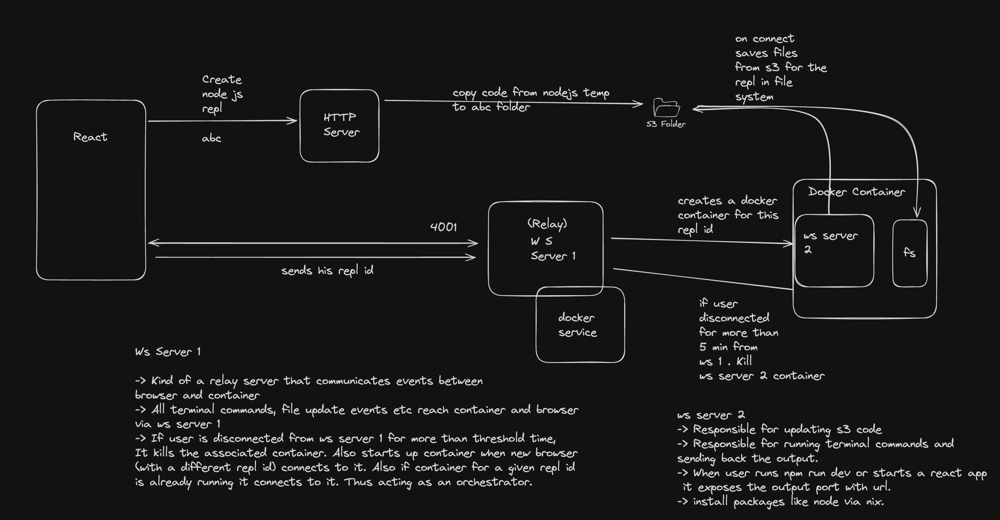

### Online IDE

#### Inspiration

This online editor is inspired by a popular online IDE [repl.it](https://github.com/replit)


##### Design


#### Tech stack Used:

The online editor is developed using the following technologies.

> React ⚛️ : Frontend
> 
>  Socket.io 🔌 : Backend web socket connection
> 
>  Nodejs 🧑‍💻 : Web Server
> 
>  Docker 🐳 : Providing containerized development environment to user
> 
>  GCP ☁️ : Storing project files
> 
>  Nixos / Nix ❄️ : Package management in development environment.

##### Pre requisites:

>[Docker](https://nodejs.org/en)
>
>[nodejs](https://nodejs.org/en)

#### Steps to run online editor:

1. Start docker daemon on your machine.
2. Build docker image in your machine by running following from terminal in project directory:
```
cd docker
docker build -t my-nix-node-image . 
```
3. Start the backend (nodejs socket-io server) by running following from terminal in project directory:
```
cd backend
npm install
node index.js
```

4. Start the frontend (vite-react app) by running following from terminal in project directory:
```
cd frontend
npm install
npm start
```

#### Screenshots


